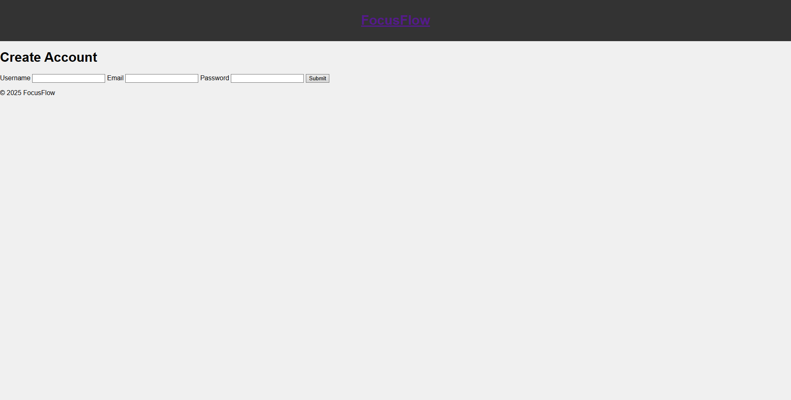
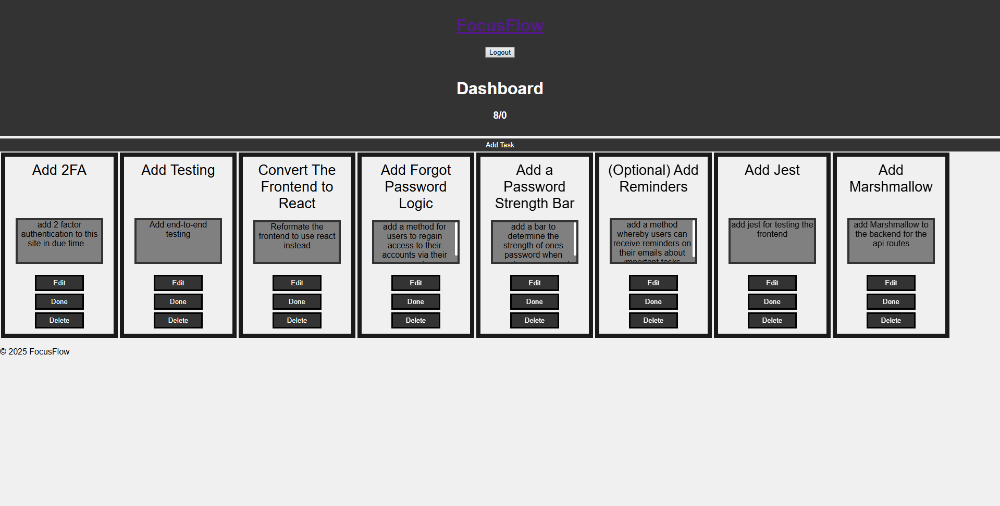

# 🧠 FocusFlow Task Manager

[](https://github.com/kyle-brougham-cook/focus-flow/actions/workflows/ci.yml)


🌐 **Live Demo**: [https://focusflow-demo.onrender.com](https://focusflow-demo.onrender.com)

---

## Intro

FocusFlow is a full-stack task manager built with Flask and vanilla JS. It handles user authentication, secure session management, task CRUD, clean API architecture, and is set up for production deployment and CI/CD.

Whether you're managing your own to-dos or showcasing a full-stack build to clients or employers, this project demonstrates how to build secure, scalable applications with a modern dev workflow.

---

## 📚 Table of Contents

- [Features](#-features)
- [Tech Stack](#-tech-stack)
- [Screenshots](#-screenshots)
- [Getting Started](#-getting-started)
  - [Local Development](#-local-development)
  - [Config Modes Overview](#%EF%B8%8F-config-modes-overview)
  - [Deploying to Render](#-deploying-to-render)
  - [Running Unit Tests](#-running-unit-tests)
- [Example .env](#-example-env)
- [License](#-license)

---

## ✨ Features

- 🔐 Secure session-based login with hashed passwords
- 📋 Create, update, and delete tasks seamlessly (no page reloads)
- 🚦 HTTPS + CORS out‑of‑the‑box for secure dev
- 🧪 Fully tested backend API endpoints
- 🔄 CI/CD ready with GitHub Actions
- 🧹 Pre-commit hooks using Black and Flake8
- 📦 Configurable via `.env` for easy deployment

---

## 🧱 Tech Stack

- **Backend**: Python, Flask, SQLAlchemy, Flask-Login
- **Frontend**: Vanilla JavaScript, HTML5, CSS3
- **Database**: PostgreSQL (prod), SQLite (local/test)
- **Auth**: Session-based w/ secure cookies
- **Deployment**: Render (Free Web Service)
- **CI/CD**: GitHub Actions (w/ Pre-commit, Black, Flake8, unittest)
- **Testing**: Python `unittest`
- **Dev Tools**: `dotenv`, `mkcert`, `gunicorn`

---

## 📸 Screenshots

### 🔐 Login Page



### 📋 Task Dashboard



### ➕ Add Task Modal

## 

## 🚀 Getting Started

### 🏠 Local Development

This app supports flexible environment configs via `.env` and `FLASK_CONFIG`.

You can use:

- SQLite for local development (`DEV_DATABASE_URL`)
- PostgreSQL locally by setting `DATABASE_URL`
- A `.env` file to control both setup and behavior

```bash
# 1. Clone the repo
git clone https://github.com/kyle-brougham-cook/focus-flow.git
cd focus-flow

# 2. Create and activate a virtualenv
python -m venv venv
source venv/bin/activate  # Windows: venv\Scripts\activate

# 3. Install dependencies
pip install -r requirements.txt

# 4. Copy and configure environment variables
cp .env.example .env
# Edit `.env` to set:
#   - FLASK_CONFIG=development
#   - SECRET_KEY=your-local-key
#   - DEV_DATABASE_URL=sqlite:///../instance/dev.db (or use DATABASE_URL for Postgres)
#   - CORS_ORIGINS=https://localhost:5000
#   - SSL_CERT & SSL_KEY if you're using mkcert

# 5. Generate local SSL certs (optional but recommended)
mkcert localhost
# Add paths to .env

# 6. Run database migrations
flask --app run.py db upgrade

# 7. Launch the dev server
python run.py
```

---

### ⚙️ Config Modes Overview

The app uses `FLASK_CONFIG` to select between:

| Mode        | FLASK_CONFIG  | DB Source          | Notes                    |
| ----------- | ------------- | ------------------ | ------------------------ |
| Development | `development` | `DEV_DATABASE_URL` | Defaults to local SQLite |
| Production  | `production`  | `DATABASE_URL`     | Use PostgreSQL in prod   |
| Testing     | `testing`     | In-memory SQLite   | Used for unit tests      |

You can override any of these by setting different values in `.env`.

---

### 🌍 Deploying to Render

Render automatically builds and deploys your app using:

- `flask --app run.py db upgrade && gunicorn run:app`
- `FLASK_CONFIG=production`

#### Render Environment Variables to Set:

```dotenv
FLASK_CONFIG=production
SECRET_KEY=your-production-key
DATABASE_URL=your-postgresql-url
CORS_ORIGINS=https://your-app.onrender.com
```

> ⚠️ Do NOT set `FLASK_APP`, `DOMAIN`, `PORT`, `SSL_CERT`, or `SSL_KEY` on Render—those are local-only.

#### ⚠️ DB Migrations in Render (Free Tier)

Since free Render plans don’t allow shell access, add this to your **Start Command** in Render's dashboard:

```bash
flask --app run.py db upgrade && gunicorn run:app
```

This ensures your PostgreSQL schema is auto-created on deploy.

---

### 🧪 Running Unit Tests

This app supports testing via Python’s built-in `unittest`.

```bash
# Use the testing config
export FLASK_CONFIG=testing  # Windows: set FLASK_CONFIG=testing

# Run the full test suite
python -m unittest discover tests
```

---

### ✅ Example `.env`

```dotenv
FLASK_CONFIG=development
DEV_DATABASE_URL=sqlite:///../instance/dev.db
SECRET_KEY=your-secret-key
PORT=5000
DOMAIN=localhost
SSL_CERT=localhost.pem
SSL_KEY=localhost-key.pem
CORS_ORIGINS=https://localhost:5000
FLASK_APP=run.py
```

---

## 💬 Contact

Built by **Kyle Brougham-Cook**
💻 [LinkedIn](https://linkedin.com/in/kyle-brougham-cook-718b672a4)
📬 Open to freelance work, contracts, backend, or remote full-stack roles.

---

## 📄 License

This project is licensed under the [MIT License](https://opensource.org/licenses/MIT). Feel free to use, fork, and adapt it as needed.

---
